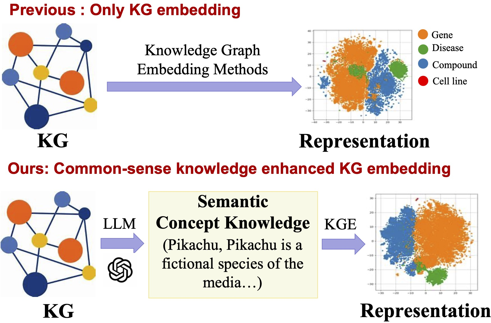

# LLaDR
Drug repurposing plays a critical role in accelerating treatment discovery, especially for complex and rare diseases. Biomedical knowledge graphs (KGs), which encode rich clinical associations, have been widely adopted to support this task. However, existing methods largely overlook common-sense biomedical concept knowledge in real-world labs, such as mechanistic priors indicating that certain drugs are fundamentally incompatible with specific treatments. To address this gap, we propose LLaDR, a Large Language Model-assisted framework for Drug Repurposing, which improves the representation of biomedical concepts within KGs. Specifically, we extract semantically enriched treatment-related textual representations of biomedical entities from large language models (LLMs) and use them to fine-tune knowledge graph embedding (KGE) models. By injecting treatment-relevant knowledge into KGE, LLaDR largely improves the representation of biomedical concepts, enhancing semantic understanding of under-studied or complex indications. Experiments based on benchmarks demonstrate that LLaDR achieves state-of-the-art performance across different scenarios, with case studies on Alzheimer’s disease further confirming its robustness and effectiveness.



## Data Preparing 

To prepare the data, you need to generate descriptions for your entities using a large language model, and then use the large language model to create embeddings for the entity names and descriptions. We provide the dataset and cases in [Google Driven]()

## LLaDR Training & Evaluation:

### Use the python xxx.py to train LLaDR and evaluation, For example:

```bash
cd code/train
python run.py --output_dir ../../processed_data # train LLaDR
cd code/evaluate
python run_transe_filtered.py --output_dir ../../processed_data # filtered tail entity prediction
```

Thank you for your interest in our work!
